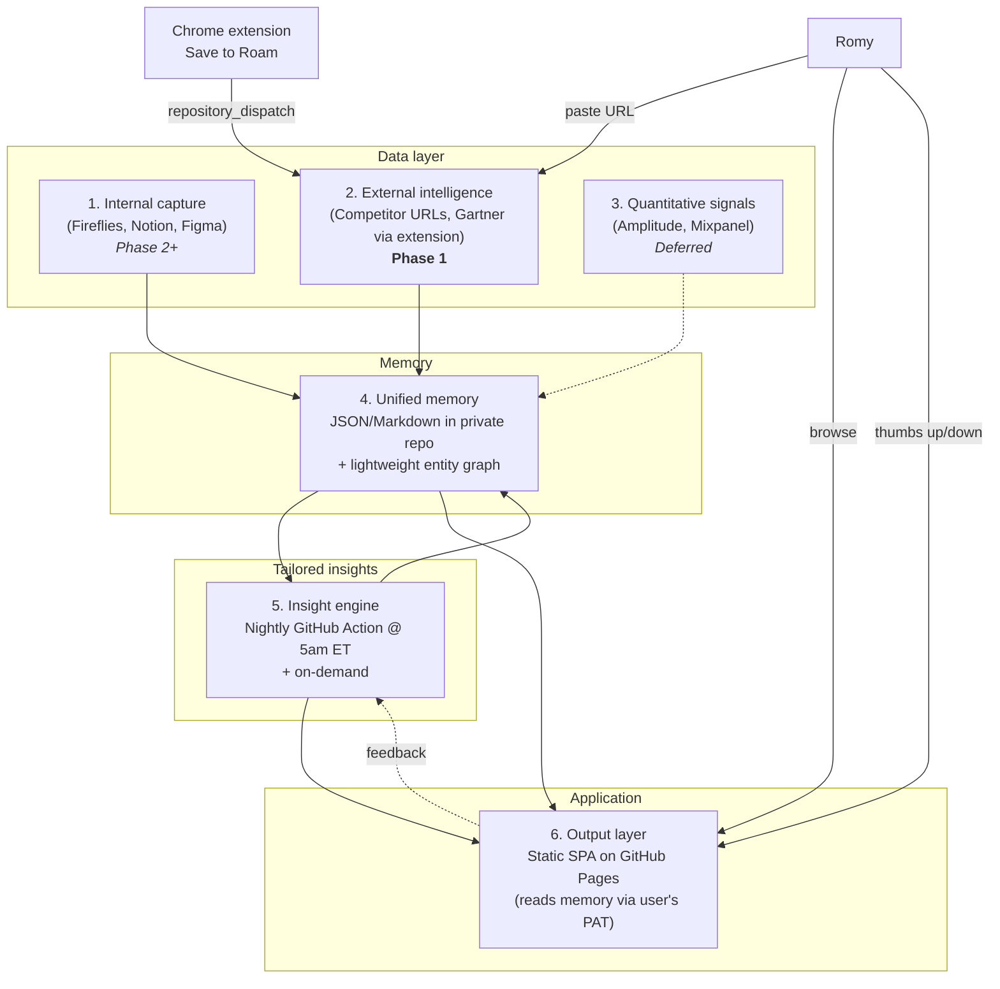

# Roam — Architecture

Six conceptual layers. They map to code organization but are not strict module boundaries — share infrastructure where it makes sense.

## Layers



## Layer-by-layer

### 1. Internal capture — _Phase 2+_
Fireflies meeting transcripts, Notion docs, Figma design files. All via MCP connectors (with manual paste-in fallback). Deferred until Romy is in the new head-of-product role and producing internal artifact volume.

### 2. External intelligence — _Phase 1_
- **Competitor URLs.** Submitted via the UI. A GitHub Action fetches and parses each URL on a weekly cron, diffs against the previous snapshot, commits new snapshots to `data/sources/compete/`.
- **Gartner / analyst pages.** Captured via a Chrome MV3 extension. The extension calls GitHub's `repository_dispatch` API (using a PAT scoped to one repo) with page title, URL, full text, and a screenshot. A dispatch-triggered workflow writes the payload to `data/sources/gartner/`.

### 3. Quantitative signals — _Deferred_
Amplitude / Mixpanel ingestion for anomaly-driven opportunity surfacing. Not in v1.

### 4. Unified memory
**The "database" is the repo.** Sources, extracted entities, opportunities, plan items, and feedback all live as JSON and Markdown files in the private repo, committed by GitHub Actions.

```
data/
├── sources/
│   ├── compete/<domain>/<YYYY-MM-DD>.json
│   └── gartner/<YYYY-MM-DD>-<slug>.json
├── entities/
│   ├── people/
│   ├── projects/
│   ├── themes/
│   └── decisions/
├── opportunities/<YYYY-MM-DD>/<id>.json
├── plan/<id>.json
├── feedback/<YYYY-MM-DD>.jsonl
└── llm-calls/<YYYY-MM-DD>.jsonl
```

**No vector DB in Phase 1.** Corpus is small enough that the nightly insight job loads the full deltas into a Claude call with prompt caching. Embeddings + retrieval revisited in Phase 3.

**Entity graph** is derived at ingest time by a lightweight extraction pass (Haiku) — outputs JSON entity records with cross-references.

### 5. Insight engine
A nightly GitHub Action (`daily-analysis.yml`, 5am ET) runs the cross-source reasoning pipeline:

1. Load the last 48h of new/changed sources.
2. Run entity extraction over them (Haiku).
3. Run insight generation over the corpus + recent feedback (Sonnet, with prompt caching).
4. Each insight must produce: sources cited, reasoning chain, confidence + justification, recommended action.
5. Write opportunities to `data/opportunities/<date>/<id>.json`.
6. Log the full LLM call (input, output, cost, latency) to `data/llm-calls/<date>.jsonl`.
7. Commit. Done.

On-demand re-runs are the same workflow triggered manually.

### 6. Output layer
A static SPA on GitHub Pages at `moav-romy.github.io/roam`. Built with Vite + React + shadcn/ui.

**Auth model:** the SPA shows a "paste your GitHub PAT" screen on first load. The token is stored in `localStorage`. The app uses it to fetch JSON files from the private data repo via the GitHub API. Public site URL, private data, no server.

**Feedback writes:** thumbs up/down POST through a small GitHub Action triggered by `repository_dispatch` (same mechanism as the extension), which appends to `data/feedback/`.

## Why GitHub-only

| Concern | How GitHub-only addresses it |
|---|---|
| Cost | $0 on Free/Pro plans for this scale |
| Hosting | GitHub Pages |
| Database | Repo contents (JSON/Markdown) |
| Auth (data side) | Private repo + PAT held by the user |
| Background jobs | GitHub Actions cron |
| Secrets | Actions secrets (Anthropic key, etc.) |
| Replayability | Every LLM call is logged as a commit; git history *is* the audit log |
| Single-user assumption | Aligns with single-tenant scope |

Trade-offs accepted: writes are commits (slow), no realtime UI, no concurrent jobs, DIY search at small scale. All fine for Phase 1.

## What the static SPA does not do

- Never calls the Anthropic API directly. All LLM work happens in Actions.
- Never holds long-lived server state.
- Never sees other users' data — there are no other users.
